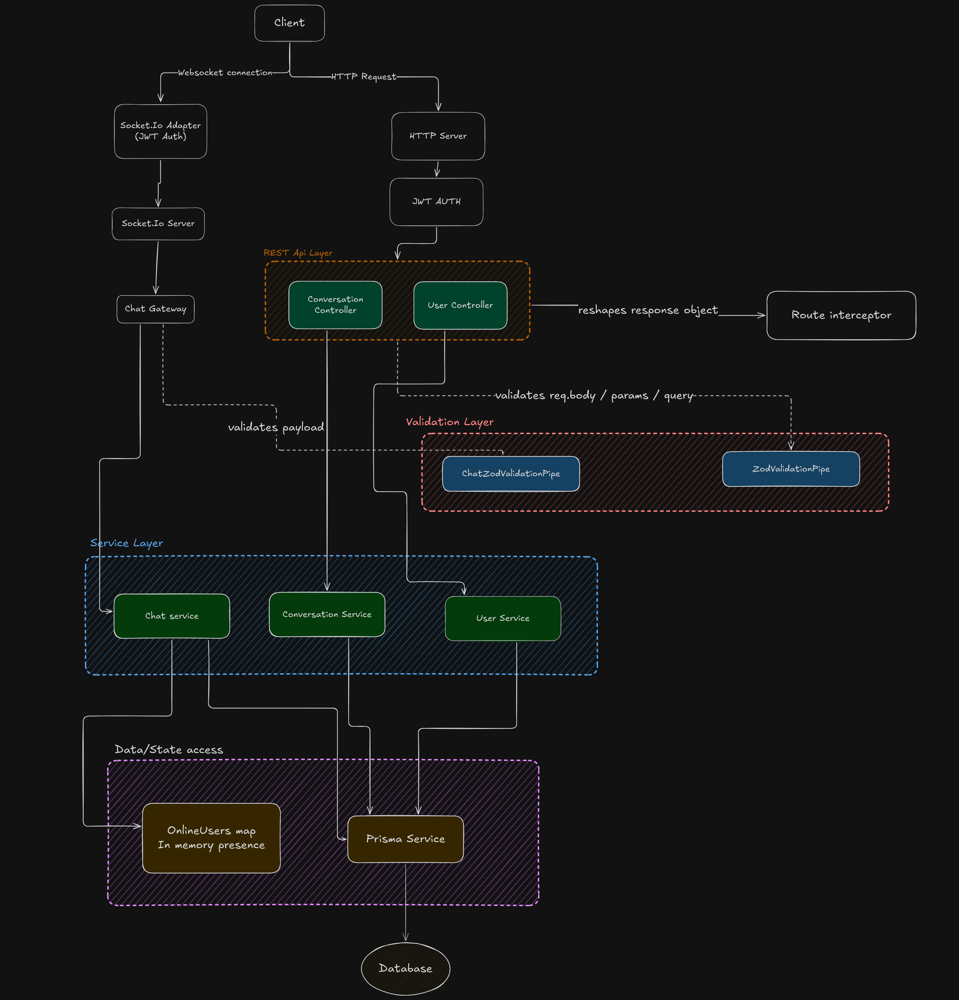

# Architecture Overview

## Diagram

## Tech Stack

| Layer      | Technology         |
| ---------- | ------------------ |
| Runtime    | Node.js            |
| Framework  | NestJS             |
| Language   | TypeScript         |
| Database   | PostgreSQL         |
| ORM        | Prisma             |
| Real-time  | Socket.IO          |
| Auth       | JWT (cookie-based) |
| Validation | Zod                |

---

## Entry Points

The server accepts two types of connections from the client:

### 1. HTTP (REST)

Requests pass through JWT authentication, then hit the NestJS HTTP server where they're routed to the appropriate controller.

### 2. WebSocket

Connections go through the custom `SocketIoAdapter`, which validates the JWT cookie at handshake time using Passport. Once authenticated, the socket is handed off to the `ChatGateway`. Auth is handshake-only — per-event validation is not implemented.

---

## Layers

### REST API Layer

Two controllers handle HTTP routes:

- **ConversationsController** — CRUD for conversation data (get by ID, get current user's conversations, delete)
- **UsersController** — user listing, current user, bookmarks, user by ID, block user

Both controllers use the `@Route()` decorator which composes:

- The HTTP method + path
- `ZodValidationPipe` for request body/params/query validation
- `RouteResponseInterceptor` to reshape the response into a consistent `{ code, message, data }` envelope

### WebSocket Layer

`ChatGateway` handles all real-time events:

| Event (Client → Server) | Description                                         |
| ----------------------- | --------------------------------------------------- |
| `message:create`        | Create and broadcast a new message                  |
| `message:read`          | Mark messages in a conversation as read             |
| `message:reaction`      | Add/update an emoji reaction on a message           |
| `typing`                | Broadcast typing indicator to conversation room     |
| `typing:stop`           | Broadcast typing stopped                            |
| `conversation:create`   | Create or retrieve a conversation with another user |

| Event (Server → Client)  | Description                                |
| ------------------------ | ------------------------------------------ |
| `message:create`         | Broadcast new message to conversation room |
| `message:create:confirm` | Confirm message delivery to sender         |
| `message:read`           | Notify room that messages were read        |
| `message:reaction`       | Broadcast updated message with reactions   |
| `typing`                 | Forward typing indicator                   |
| `typing:stop`            | Forward typing stopped                     |
| `users:presence_update`  | Broadcast updated list of online user IDs  |
| `conversation:create`    | Emit newly created/found conversation      |

### Validation Layer

Two Zod-based pipes:

- **`ZodValidationPipe`** — used in the REST layer. Validates body, params, and query against schemas defined on each `Route` object
- **`ChatZodValidationPipe`** — used in the WebSocket layer. Validates `@MessageBody()` payloads against the `ClientEvents` schema group

### Service Layer

Business logic is handled by three services:

- **`ChatService`** — real-time logic: connection/disconnection handling, message creation, read receipts, reactions, conversation room joining, and in-memory presence tracking
- **`ConversationsService`** — persistent conversation queries: fetch by ID, fetch all for current user, delete. Maps messages to include `isMine` and `isBookmarked` flags per user
- **`UsersService`** — user queries: list all users with `hasConversation`/`mutualConversation` context, get user by ID with relations, bookmarks, block user

---

## Auth

- On signup, password is hashed with `bcryptjs` (salt rounds: 10) and a random avatar URL is generated
- On login, a JWT is signed and set as an `httpOnly` cookie (`jwt`) with a 7-day `maxAge`
  - Token expiry (`signOptions.expiresIn`) is set to `3d` in the JWT module — note the mismatch with the cookie's 7-day `maxAge`
- The JWT is extracted from cookies (not the `Authorization` header) in both the HTTP guard (`JwtStrategy`) and the WebSocket adapter
- No refresh token flow is implemented — once a token expires, the user must log in again

---

## Data & State

### PostgreSQL via Prisma

All persistent data is accessed through `PrismaService`, which extends `PrismaClient` and is registered as a global singleton via `DbModule`. Used by all three services.

### In-Memory Presence (`OnlineUsers` map)

`ChatService` maintains a `Map<userId, { socket, isOnline, timerId }>` to track connected users.

- On connect: user is added, any pending disconnect timer is cleared, all connected clients are notified
- On disconnect: a 5-second grace timer fires before the user is removed and their `lastSeen` is updated in the DB — this prevents presence flicker on brief network drops
- The map is also used to join the other user's socket to a conversation room when a new conversation is created

**Limitation:** this map is local to the process. Horizontal scaling across multiple instances will cause divergent presence state. A Redis-backed solution (e.g. Redis pub/sub + Redis Sets) would be required for multi-instance deployments.

---

## CORS & Cookie Config

Allowed origins are `http://localhost:5173` and `CLIENT_URL` from env. Credentials are enabled.

Cookie settings:

- `httpOnly: true`
- `secure: true` in production
- `sameSite: 'none'` in production, `'lax'` in development
- `maxAge`: 7 days

---

## Known Gaps & Notes

| Item                             | Detail                                             |
| -------------------------------- | -------------------------------------------------- |
| No refresh tokens                | JWT expiry forces re-login                         |
| WebSocket auth is handshake-only | A revoked token won't disconnect an active session |
| In-memory presence               | Not safe for horizontal scaling                    |
